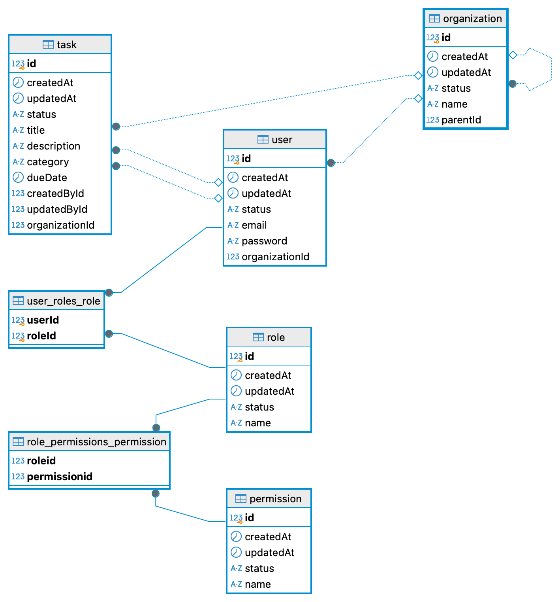

# Task Management System (Nx Monorepo)

<a alt="Nx logo" href="http://localhost:4200" target="_blank" rel="noreferrer"></a>

## 📄 Setup Instructions

## Prerequisites

You do **not** need Node.js or Angular CLI installed locally if you use Docker as described below.

Ensure you have:

- **Docker:** v24.x or higher
- **Docker Compose:** v2.x or higher

For advanced/manual development (outside Docker), ensure you have:

- **Node.js:** v24.x or higher
- **Nx CLI:** v21.x or higher
- **NestJS:** v11.x or higher
- **Angular CLI:** v20.x or higher
- **Tailwind CSS:** v3.4.x or higher
- **Jest:** v29.7.x or higher

Check your versions with:

```bash
docker -v
docker compose version
node -v
nx --version
ng --version
nest --version
npx tailwindcss --version
npx jest --version
```

> **Note:** If using Docker for all development, these will be handled automatically inside containers.

### Environment Variables
Create `.env` files in the project root and/or in `apps/api/` and `apps/dashboard/` as needed. Example:
```env
# apps/api/.env
JWT_SECRET=your-secret
DB_HOST=your-db-host
DB_USER=your-db-user
DB_PASS=your-db-pass
```

### Running the Apps
Start both backend (NestJS) and frontend (Angular) with Docker Compose:
```bash
docker-compose up --build
```
- **Frontend:** [http://localhost:4200/](http://localhost:4200/)
- **Backend API:** [http://localhost:3001/api](http://localhost:3001/api)


## 🏗️ Architecture Overview

## Technology Stack

- **Angular** (frontend)
- **NestJS** (backend, REST API)
- **Nx Monorepo** (workspace orchestration)
- **Tailwind CSS** (styling for frontend)
- **Jest** (unit testing)
- **Docker & Docker Compose** (containerization)

### NX Monorepo Layout
- `apps/` contains:
  - `dashboard/` (Angular frontend)
  - `api/` (NestJS backend)
- `libs/` contains shared code (interfaces, utilities, etc.)

Nx helps manage dependencies, code sharing, and consistent tooling.

### Shared Libraries
- Common interfaces and utilities are in `libs/` and imported by both apps.


## Data Model Explanation

### Schema

There are the entities:

- **User**: id, email, password, roles, organization
- **Task**: id, title, description, assignedTo, status
- **Organization**: id, name, users
- **Role**: id, name, permissions

### ERD Diagram




## Access Control Implementation

### Roles, Permissions, and Organization Hierarchy

- **Roles**: Users can have roles (e.g., Admin, Manager, User).
- **Permissions**: Each role has specific permissions (CRUD tasks, manage users).
- **Organization Hierarchy**: Users belong to organizations, which scope data access.

### JWT Auth Integration

- **JWT**: Used for authentication and session management.
- **Guards**: Routes are protected via `@UseGuards(JwtAuthGuard)`.
- **Role/Permission Checks**: Custom guards/decorators check user permissions at runtime.


## API Documentation

### Endpoint List & Sample Request/Responses

The backend API is built with NestJS and exposes RESTful endpoints at `http://localhost:3000/api`.

**Authentication**

- `POST /api/auth/login`
  Authenticate with email and password. Returns a JWT access token.
  Example:
    - Request: `{ "email": "user@example.com", "password": "password" }`
    - Response: `{ "access_token": "..." }`

**Tasks**

- `GET /api/tasks`
  List all tasks. Requires authentication.
  Example:
    - Header: `Authorization: Bearer <token>`
    - Response: `[ { "id": 1, "title": "Task 1", ... } ]`

- `GET /api/tasks/:id`
  Get a specific task by ID. Requires authentication.
  Example:
    - Header: `Authorization: Bearer <token>`
    - Params: `"id": 1`
    - Response: `{ "id": 1, "title": "Task 1", ... }`

- `POST /api/tasks`
  Create a task. Requires authentication.
  Example:
    - Header: `Authorization: Bearer <token>`
    - Body: `{ "title": "New Task", "description": "Details" }`
    - Response: `{ "id": 2, "title": "New Task", ... }`

- `PUT /api/tasks/:id`
  Update a task. Requires authentication.
  Example:
    - Header: `Authorization: Bearer <token>`
    - Params: `"id": 2`
    - Body: `{ "title": "New Task 2", "description": "Details" }`
    - Response: `{ "id": 2, "title": "New Task 2", ... }`

- `DELETE /api/tasks/:id`
  Delete a task. Requires authentication.
  Example:
    - Header: `Authorization: Bearer <token>`
    - Params: `"id": 2`
    - Response: `{ "message": "Task deleted successfully" }`


## Future Considerations

### Advanced Role Delegation

- Support for hierarchical roles (delegation, role inheritance).
- Allow organization admins to delegate specific permissions.

### Production-Ready Security

- **JWT Refresh Tokens**: Implement for session longevity.
- **CSRF Protection**: Add CSRF tokens for frontend forms.
- **RBAC Caching**: Cache roles/permissions for efficient authorization checks.

### Scaling Permission Checks

- Use distributed caching (e.g., Redis) for permission data.
- Optimize DB queries for large organizations.

### 🚀 Production Deployment

For production, you may use nginx as a reverse proxy:
- Serve the Angular build (`dist/apps/dashboard`) as static files.
- Proxy `/api` requests to the NestJS backend.
- Benefits: Centralized routing, SSL, caching.

For development, direct port mapping via Docker Compose is sufficient.
